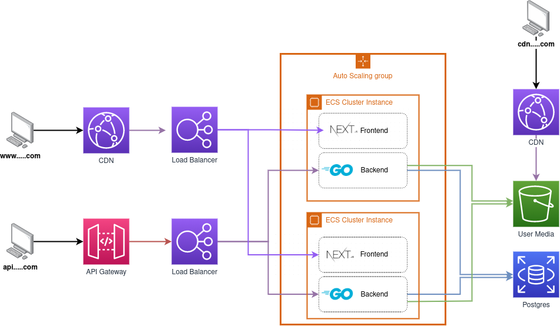
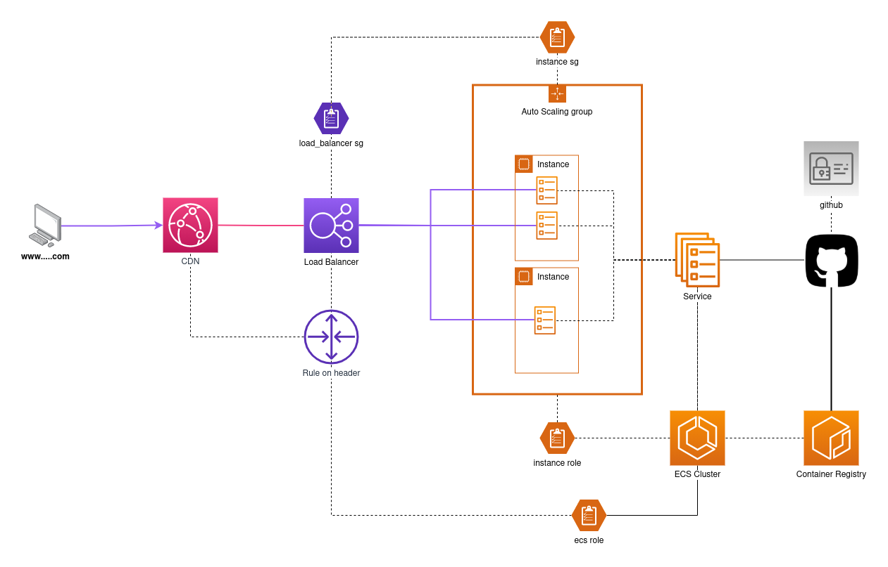
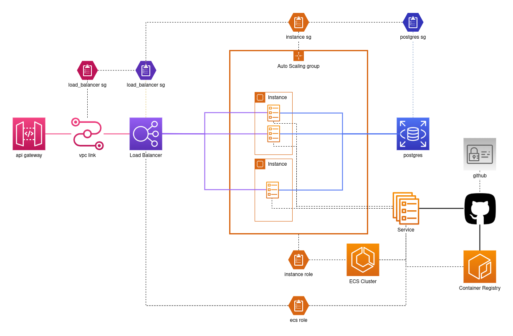

[PUBLIC] Infrastructure
==============

The infrastructure of Treepli is divided in two main groups:

- frontend, which is composed by a Next (react) application ontainerized and deployed in an autoscaled ecs cluster with a cloudfront cdn in front

- backend, which is composed by a go application containerized and deployed in an autoscaled ecs cluster, with an api gateway and load balancer in front, with an rds instance to serve as a database

- media cdn, which is composed by a s3 bucket, controlled by the backend (uploading files), with a cloudfront cdn in front

## Frontend

In particular, frontend is composed of:

- a cloudfront cdn that caches traffic to the load balancer
- a load balancer, controlled by the ecs service through the ecs role. The load balancer only allows traffic with a given header set (see https://docs.aws.amazon.com/AmazonCloudFront/latest/DeveloperGuide/restrict-access-to-load-balancer.html)
- an autoscaling group (shared with backend) spawning container instances that connect to the ecs cluster through the instance role
- an ecs cluster (shared with backend) composed of a service that spawns containers into the container instances and register them in the load balancer. The ecs service can also be controlled by github, specifically rolling out a new deployent.
- a container registry containing the docker images, with a policy that allows github to push new images during deployment

## Backend

In particular, backend is composed of:

- a rate-limited api gateway with a default route forwarding all traffic to the load balancer. The VPC link is needed to access the load balancer which is internal.
- an internal load balancer, controlled by the ecs service through the ecs role
- an autoscaling group (shared with frontend) spawning container instances that connect to the ecs cluster through the instance role
- an ecs cluster (shared with frontend) composed of a service that spawns containers into the container instances and register them in the load balancer. The ecs service can also be controlled by github, specifically rolling out a new deployent.
- a postgres database
- a container registry containing the docker images, with a policy that allows github to push new images during deployment
